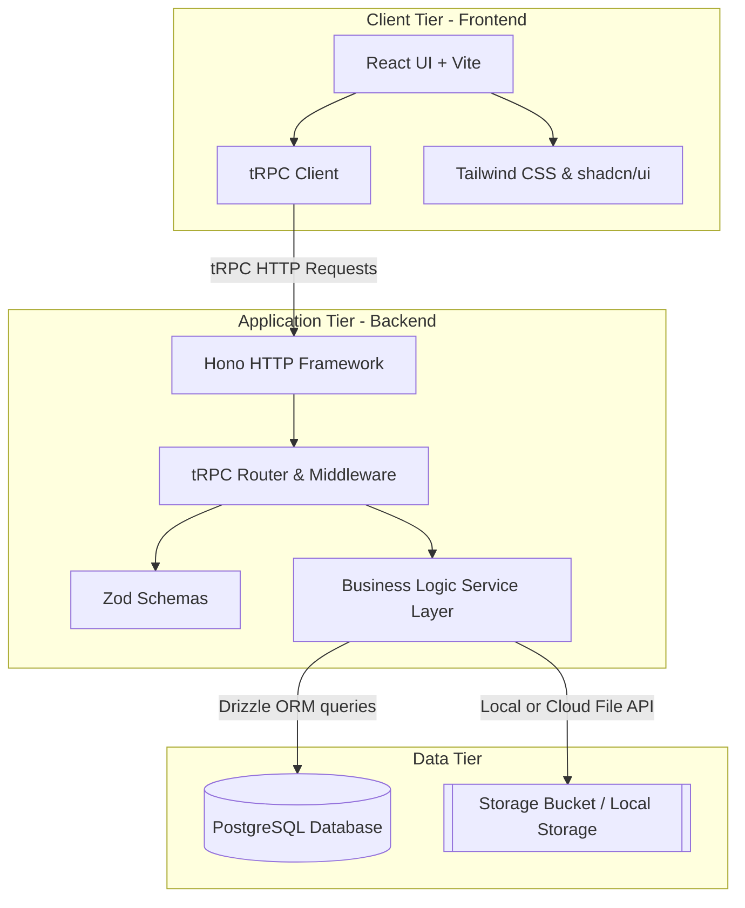
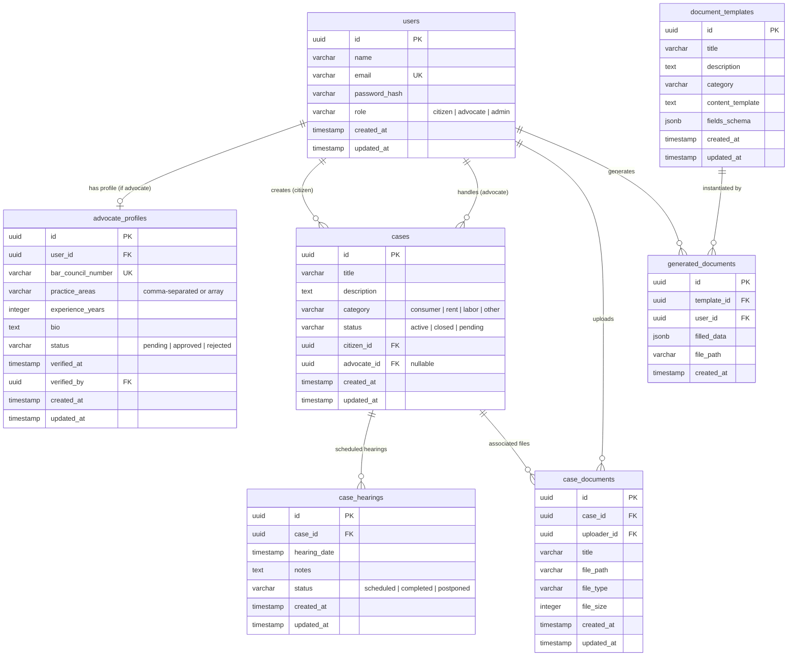
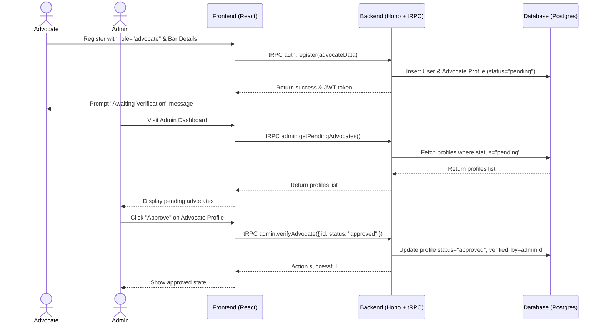
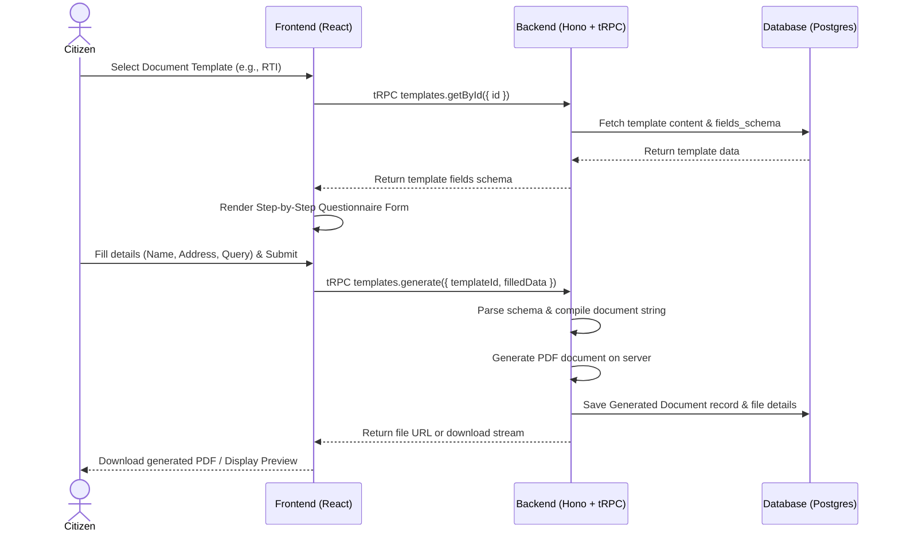

# System Design Document

This document describes the architectural design, database schema, and component structure for **Themis**.

---

## 1. High-Level Architecture

Themis follows a multi-tier Client-Server architecture utilizing a modern typesafe monorepo stack:



---

## 2. Database Schema Design (ERD)

The database schema is designed to support users (citizens, advocates, and admins), case workflows, document management, and lawyer verification.



---

## 3. Key Sequence Flows

### 3.1 Advocate Registration & Verification
This flow details how an advocate registers and gets verified by an admin to gain platform credibility and list in the public directory.



### 3.2 Legal Document Automation
This flow shows how a citizen utilizes guided templates to generate automated legal documents (e.g., RTI application).



---

## 4. Module & Directory Structure

To structure our monorepo cleanly, we organize our files as follows:

```text
/
├── docs/                      # Technical specification documentation
│   ├── SRS.md
│   └── system_design.md
├── package.json               # Monorepo workspaces definition
├── frontend/                  # React + Vite + TS client app
│   ├── index.html
│   ├── vite.config.ts
│   ├── package.json
│   ├── tailwind.config.js
│   ├── src/
│   │   ├── main.tsx
│   │   ├── App.tsx
│   │   ├── index.css          # Design system variables & custom styles
│   │   ├── components/        # Reusable shadcn/ui & generic components
│   │   │   └── ui/            # shadcn component templates
│   │   ├── hooks/             # Custom React hooks (tRPC queries/mutations)
│   │   ├── pages/             # Route-level page views (Dashboard, Search, etc.)
│   │   ├── utils/             # Helper utilities (tRPC client config)
│   │   └── types/             # Frontend-specific types
└── backend/                   # Hono + tRPC + Drizzle server app
    ├── package.json
    ├── tsconfig.json
    ├── src/
    │   ├── index.ts           # Hono entry point
    │   ├── db/                # Drizzle DB config and schemas
    │   │   ├── client.ts      # Database connection client
    │   │   └── schema.ts      # Single file or split schemas
    │   ├── trpc/              # tRPC router declarations
    │   │   ├── context.ts     # tRPC context setup
    │   │   ├── trpc.ts        # Router initialization & middlewares
    │   │   └── routers/       # Module routers (auth, case, advocate, etc.)
    │   └── utils/             # Common helper modules (JWT token handling, etc.)
```
